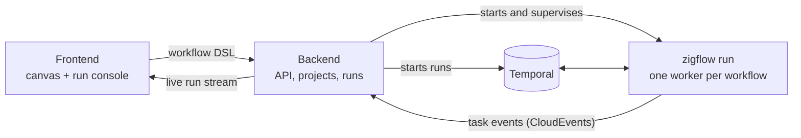

# Duraflow

**Design durable workflows visually, then watch every run unfold on the same canvas.**

Duraflow is an open-source visual builder and run console for durable workflows. You draw a workflow as a flowchart — call an API, set some variables, branch, loop, run steps in parallel, wait, retry — and Duraflow turns it into a [Zigflow](https://github.com/zigflow/zigflow) workflow definition that executes on [Temporal](https://temporal.io/). When it runs, the canvas lights up with the path the run actually took: which steps succeeded, which failed, which branches were skipped, and the exact input and output of every step.

## Why Duraflow

Durable execution engines like Temporal are the right foundation for work that must not get lost: order fulfilment, payments, onboarding, data pipelines, anything that spans minutes to months and has to survive crashes, deploys and flaky third-party APIs. Temporal guarantees your workflow finishes. But getting there usually means:

- **Writing and deploying code for every workflow.** A small change to a business process becomes a development ticket, a code review and a release.
- **Operating blind.** When a run misbehaves, you reconstruct what happened from event histories and logs. Nested loops, parallel branches and child workflows make that even harder.
- **A wall between the people who own the process and the people who can change it.**

[Zigflow](https://github.com/zigflow/zigflow) removes the first problem: workflows are declared in YAML, based on the [CNCF Serverless Workflow](https://serverlessworkflow.io/) specification, and run on Temporal without writing worker code. Duraflow removes the rest. It puts a visual editor on top of that DSL and a run console that shows what happened in the terms you designed it in, not in Temporal's internals.

The result: the reliability of Temporal, the speed of low-code, and a workflow you can actually see.

## What you can do with it

**Build visually, keep the DSL honest.**
Drag steps onto a canvas and configure them in a side panel. Nested bodies (loops, parallel branches, try/catch) render inline on the same canvas, to any depth, so there is no clicking in and out of sub-flows. The YAML is always one click away and editable in both directions. The canvas is derived from the DSL, never the other way around, so what you see is exactly what runs, and every workflow is a plain text file you can review, diff and version.

**Speak the full workflow language.**
REST and gRPC calls, variable assignment, switch branching, for-each loops, parallel forks, try/catch, waits, listening for signals, queries and updates, raising errors, running scripts, shell commands and containers, and calling other workflows as children. Every step can be guarded by a condition, reshape its output, and carry its own retry policy and timeouts.

**Compose expressions without memorising jq.**
Values are built from chips: pick `$input.userId`, add a `tostring` transform, join it with a string. The builder knows which variables exist at each step. Raw jq is always available when you need it.

**See every run.**
Hit Run and the workflow executes for real, on Temporal. The canvas colours each step as it starts and finishes. The path not taken is visibly skipped, loop iterations and retries are kept as separate attempts, and you can inspect any step's input, output and the variables it changed. Child workflows link straight to their own runs. A finished run replays exactly the same way later, from the executions list.

**Run it like a platform.**
Organise workflows into projects, see every run across projects with filters for status, workflow and date, and see the worker behind each workflow. Duraflow starts and supervises one Zigflow worker per workflow for you, so saving a workflow is all it takes to make it runnable.

## How it works

1. **Design.** The frontend's Zigflow engine converts between the canvas and the DSL, validating against the published Zigflow JSON Schema.
2. **Deploy.** Saving a workflow stores its DSL, and the backend (re)starts a dedicated `zigflow run` worker that registers the workflow with Temporal.
3. **Execute.** Starting a run is a real Temporal workflow execution. Temporal provides durability, retries and timers.
4. **Observe.** Each worker reports every task's start, completion and failure, with inputs and outputs, as CloudEvents to the backend. The backend records them against the run, works out which loop, branch or child workflow each one belongs to, and streams them to the browser, which replays them onto the canvas.

The backend exposes a full REST API with generated OpenAPI docs, so everything the UI does can be automated.

## Built with

- **Frontend:** SvelteKit (Svelte 5), Svelte Flow, CodeMirror, Tailwind CSS with daisyUI
- **Backend:** Go, Huma (OpenAPI 3.1) on Echo, GORM with SQLite or Postgres
- **Execution:** Temporal and Zigflow

## Project status

Duraflow is young and moving quickly. The builder, real execution and run observability work end to end today. Schedules and backfills are modelled in the API and UI but don't trigger runs yet, and a few advanced step options can only be edited in the DSL view for now. Expect rough edges and breaking changes. Feedback and contributions are very welcome.

## Try it

With Docker installed, `docker compose up --build` starts Temporal, the backend and the frontend; open `http://localhost:5173`. See [CONTRIBUTING.md](CONTRIBUTING.md) for the full development setup.

## Contributing

Bug reports, ideas and pull requests are all welcome. Start with [CONTRIBUTING.md](CONTRIBUTING.md).

## License

Duraflow is released under the [MIT License](LICENSE).

Duraflow builds on [Temporal](https://temporal.io/) and [Zigflow](https://github.com/zigflow/zigflow), which are separate projects under their own licenses.
